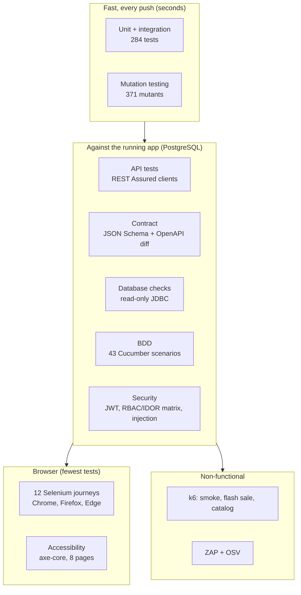
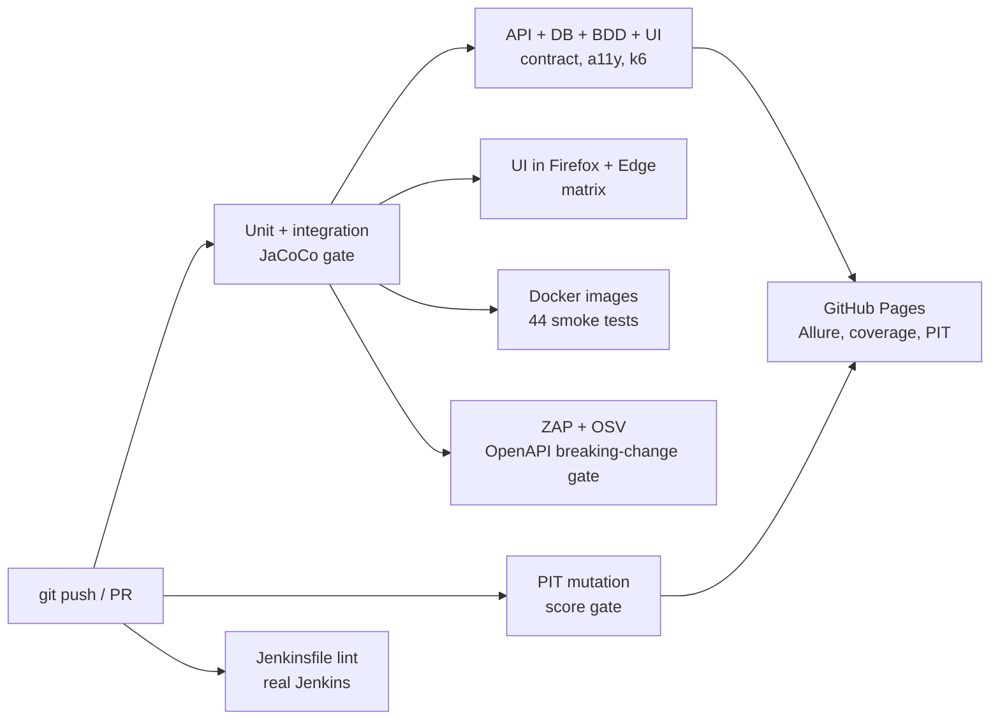

# RbcTcsWorld E-Commerce Suite

[](https://github.com/rbchy/RbcTcsWorld_ECommerceSuite/actions/workflows/ci.yml)


[](https://rbchy.github.io/RbcTcsWorld_ECommerceSuite/coverage/)
[](https://rbchy.github.io/RbcTcsWorld_ECommerceSuite/mutation/)
[](https://rbchy.github.io/RbcTcsWorld_ECommerceSuite/)

An Amazon-inspired online store (catalog, cart, checkout, payment, shipping, returns, reviews, wishlist)
that I built **to be tested**: the application is the test object, and the real work is the test system around it.
Every push goes through 14 quality gates in GitHub Actions; the same pipeline runs in Jenkins on a Mac.

Author: **RB Chowdhury**, QA Automation Engineer / SDET - [GitHub](https://github.com/rbchy) · [LinkedIn](https://www.linkedin.com/in/rbchy/)

---

## Reviewing this in 5 minutes

1. **Latest build:** the screenshot below (Jenkins build 17, all gates passed), or the
   [GitHub Actions runs](https://github.com/rbchy/RbcTcsWorld_ECommerceSuite/actions).
2. **Live reports:** [Allure](https://rbchy.github.io/RbcTcsWorld_ECommerceSuite/) ·
   [JaCoCo coverage](https://rbchy.github.io/RbcTcsWorld_ECommerceSuite/coverage/) ·
   [PIT mutation](https://rbchy.github.io/RbcTcsWorld_ECommerceSuite/mutation/)
3. **Defects the tests actually found:** [Defect Reports](docs/qa/DEFECT_REPORTS.md) - 20 entries, each with
   evidence, root cause, fix and regression test.
4. **How release decisions are made:** [Test Strategy](docs/qa/TEST_STRATEGY.md) ·
   [Risk Register](docs/qa/RISK_REGISTER.md) · [Test Summary Report (GO / NO-GO)](docs/qa/TEST_SUMMARY_REPORT.md)
5. **Code to read first:** the [pipeline](.github/workflows/ci.yml), the
   [flash-sale concurrency test](automation/src/test/java/com/rbctcsworld/ecommerce/qa/tests/api/InventoryConcurrencyTest.java),
   the [API contract test](automation/src/test/java/com/rbctcsworld/ecommerce/qa/tests/api/ApiContractTest.java) and the
   [access-control matrix](automation/src/test/java/com/rbctcsworld/ecommerce/qa/tests/security/AccessControlMatrixTest.java).


*One page per Jenkins build with every gate, generated by [`ci/qa_dashboard.py`](ci/qa_dashboard.py).*

---

## Quality gates

A gate fails the build. Nothing is "reported only" unless the table says so.

| # | Gate | Threshold | Current | Tool |
|---|---|---|---|---|
| 1 | Backend unit + integration | 100 % pass | 284 / 284 | JUnit 5, Mockito, H2 + Flyway |
| 2 | API, database, BDD, UI | 100 % pass | 287 / 287 | REST Assured, JDBC, Cucumber 7, Selenium 4 |
| 3 | Line / branch coverage | >= 97 % / >= 88 % | 97.5 % / 88.3 % | JaCoCo |
| 4 | Mutation score | >= 84 % | 84.9 % (test strength 97.5 %) | PIT |
| 5 | API contract, consumer side | every response matches its schema | 12 strict JSON Schemas | json-schema-validator |
| 6 | API contract, provider side | no breaking change vs. approved baseline | 0 (gate has its own self-test) | openapi-diff |
| 7 | Accessibility | 0 serious / critical | 0 on 8 pages | axe-core, WCAG 2.1 A + AA |
| 8 | Cross-browser | 100 % pass | 20 / 20 in Firefox and Edge | Selenium, CI matrix |
| 9 | Performance | SLO thresholds (p95, error rate, no overselling) | p95 16-72 ms, 0 % errors | k6 |
| 10 | DAST | 0 Medium / High | 0 | OWASP ZAP API scan |
| 11 | Dependencies | 0 known vulnerabilities, 0 open exceptions | 0 | OSV-Scanner |
| 12 | Containers | stack healthy, smoke tests pass | 44 / 44 | Docker Compose |
| 13 | Traceability | every requirement has a test | 63 / 63 | `docs/qa/check_rtm.py` |
| 14 | Pipeline definition | Jenkinsfile valid | validated by a real Jenkins | declarative linter |

Thresholds are set just under the measured value on purpose: they stop regressions without inviting
tests that exist only to move a number.

---

## Test architecture



Design choices behind it:

- **The pyramid is real, not drawn.** Business rules (prices, tax, coupons, order state machine, return
  window) are tested at the unit level; the browser tests only check what a customer sees. Preconditions
  for UI tests (a paid order, a delivered order, a wishlist) are created through the API, so a UI test
  never clicks through five pages to reach the one it is testing.
- **Mutation testing over coverage.** Coverage was 96 % when PIT showed that "a paid order cannot be paid
  again" passed even with the charge happening (`anyLong()` does not match `null`, DEF-013).
  Coverage says the code ran; mutation testing says a test would notice if it were wrong.
- **Contracts from both sides.** Consumer schemas use `additionalProperties: false`, so a leaked field
  (customer e-mail in public tracking, a full card number) fails a test. The provider side diffs the live
  OpenAPI document against an approved baseline; changing the contract is a deliberate, reviewed step.
- **Concurrency is tested, not assumed.** 300 buyers race for 50 units; exactly 50 orders succeed and
  stock ends at 0 (atomic conditional `UPDATE` plus a CHECK constraint). k6 repeats this in every build.
- **Stable locators and waits.** `data-testid` attributes only, explicit waits only, no `Thread.sleep`.
  A flaky test is treated as a defect and gets a report (DEF-008 to DEF-010, DEF-019).
- **Risk drives scope.** Each requirement is linked to a risk and a test in the
  [traceability matrix](docs/qa/TRACEABILITY_MATRIX.md); CI fails if a requirement loses its last test.

---

## Pipeline



The same stages run in a [Jenkinsfile](Jenkinsfile) with parameters (`BROWSER`, `RUN_UI`, `RUN_MUTATION`,
`RUN_SECURITY`). Two CI systems on two CPU architectures (Linux x86 and macOS ARM) have already paid for
themselves: four defects appeared on only one of them (DEF-014, DEF-015, DEF-019, DEF-020).

---

## What the tests found

All entries are in [Defect Reports](docs/qa/DEFECT_REPORTS.md). A selection:

| ID | Found by | Defect | Outcome |
|---|---|---|---|
| DEF-003 / 004 | Attack tests | No brute-force lockout; login timing revealed which e-mails exist | Lockout + constant-time login |
| DEF-005 | OSV scan | 21 vulnerable libraries | 0, with a CVE gate in CI |
| DEF-007 | k6 report | Catalog returned every product in one response | Pagination, response -91 %, p95 22 -> 9 ms |
| DEF-013 | PIT | A test that could never fail | Fixed + 30 targeted tests, score 65.5 -> 84.9 % |
| DEF-016 | Selenium | Fast typing showed results of an older search | Request guard + debounce |
| DEF-017 | ZAP + API test | `?=x` query string returned 500 | 400, regression test with a raw HTTP client |
| DEF-018 | axe-core (written first) | All 8 pages failed WCAG 2.1 AA (contrast, labels, page language) | 0 serious / critical |
| DEF-020 | Jenkins on macOS | Edge / Firefox drivers could not be downloaded | Selenium 4.25 -> 4.49 |

Two critical Spring CVEs had no patch for Spring Boot 3.5. They were accepted for a limited time (reason,
expiry date, guard test) and then removed by upgrading to Spring Boot 4.1 on a branch. The gates caught
three regressions before the merge (a new Tomcat CVE, DEF-016, DEF-017).

---

## Known limitations

Stating these is part of the test report, not a footnote.

- **Payments are mocked.** A deterministic gateway with test card numbers; no provider sandbox yet.
- **Login lockout is held in memory.** Correct for one instance; several instances would need a shared
  store (e.g. Redis).
- **No refresh tokens.** Access tokens expire and the user logs in again.
- **Automated accessibility rules find part of the problems.** Keyboard-only, screen-reader and zoom
  checks are manual items on the release checklist.
- **Safari runs only on a Mac** (Jenkins `BROWSER=safari`, no headless mode); no mobile devices.
- **k6 numbers come from CI runners** and are for comparison between builds, not capacity planning.

---

## Stack

| Layer | Technology |
|---|---|
| Backend | Java 21, Spring Boot 4.1 (Spring 7, Jackson 3, Tomcat 11), Spring Security + JWT, PostgreSQL 16, Flyway |
| Storefront | React + Vite |
| Test automation | JUnit 5, REST Assured, Selenium 4 (Page Objects), Cucumber 7 + PicoContainer, axe-core, JDBC |
| Test quality | JaCoCo, PIT |
| Non-functional | k6, OWASP ZAP, OSV-Scanner, openapi-diff |
| Reporting | Allure (trend history, HTTP attachments, failure categories), Cucumber HTML, per-build QA dashboard |
| Delivery | Docker (multi-stage, non-root), Docker Compose, GitHub Actions, Jenkins |

---

## Run it

**Whole application, one command** (PostgreSQL + backend + storefront):

```bash
docker compose --profile app up -d --build        # storefront http://localhost:5173, API http://localhost:8081
docker compose --profile app down                 # add -v to delete the database
```

**Development** (backend from Eclipse or Maven, live-reloading UI):

```bash
docker compose up -d                              # PostgreSQL only
cd backend && mvn spring-boot:run                 # API on 8081; Flyway creates tables and demo data
cd frontend && npm install && npm run dev         # UI on 5173
```

| | |
|---|---|
| Backend API | http://localhost:8081 (8080 stays free for Jenkins) · OpenAPI description at `/v3/api-docs` |
| PostgreSQL | localhost:5432, database / user / password `ecommerce` |
| Admin (dev only) | `admin@rbctcsworld.com` / `Admin@12345`, override with `ADMIN_EMAIL`, `ADMIN_PASSWORD` |
| Coupons | `WELCOME10`, `SAVE5`, `EXPIRED20`, `FUTURE15`, `DISABLED` |
| Test cards | `4242424242424242` approved · `4000000000000002` declined · `4000000000009995` insufficient funds |

## Run the tests

`mvn test` in the root folder runs the backend tests only. The automation suite needs the backend on 8081
(and the storefront on 5173 for `ui` and `a11y`).

```bash
mvn -f backend/pom.xml verify                                   # unit + integration + coverage gate
mvn -f backend/pom.xml -Pmutation -Djacoco.skip=true test-compile org.pitest:pitest-maven:mutationCoverage   # PIT
mvn -f automation/pom.xml clean test -DexcludedGroups=ui        # API, contract, DB, BDD, security
mvn -f automation/pom.xml clean test -Dgroups=ui                # UI + accessibility, headless Chrome
mvn -f automation/pom.xml clean test -Dgroups=ui -Dbrowser=edge # chrome | firefox | edge | safari
mvn -f automation/pom.xml clean test -Dcucumber.filter.tags="@flagship"   # register-to-refund journey
mvn -f automation/pom.xml allure:serve                          # open the Allure report
```

Other tags: `contract`, `a11y`, `db`, `security`, `concurrency`, `payment`, `returns`.
k6 scripts and how to run them: [performance](docs/modules/PERFORMANCE_K6_BN.md).

---

## Repository layout

```text
backend/        Spring Boot API, unit + integration tests, PIT profile
frontend/       React storefront (data-testid on every element a test touches)
automation/     API clients, Page Objects, Cucumber features, contract schemas, test data fixtures
performance/    k6 scripts with SLO thresholds
security/       ZAP rules, OSV configuration, version check
ci/             QA dashboard generator for Jenkins
docs/qa/        Test strategy, plan, risk register, RTM, defect reports, test summary report
docs/modules/   Module guides (Bangla), one per feature or test layer
```

## Documentation

**QA documents (English):** [Strategy](docs/qa/TEST_STRATEGY.md) · [Plan](docs/qa/TEST_PLAN.md) ·
[Risks](docs/qa/RISK_REGISTER.md) · [Traceability (63 requirements)](docs/qa/TRACEABILITY_MATRIX.md) ·
[Defects (20)](docs/qa/DEFECT_REPORTS.md) · [Test Summary Report](docs/qa/TEST_SUMMARY_REPORT.md)

**Module guides (Bangla):**

| Area | Guide |
|---|---|
| Foundation, cart, orders + inventory, checkout + payment, fulfilment + returns, reviews + wishlist | [Module 0](docs/modules/MODULE_00_FOUNDATION_BN.md) · [1](docs/modules/MODULE_01_CART_BN.md) · [2](docs/modules/MODULE_02_ORDERS_INVENTORY_BN.md) · [3](docs/modules/MODULE_03_CHECKOUT_PAYMENT_BN.md) · [4](docs/modules/MODULE_04_FULFILLMENT_RETURNS_BN.md) · [5](docs/modules/MODULE_05_REVIEWS_WISHLIST_BN.md) |
| Storefront and UI tests, cross-browser | [FRONTEND_UI_TESTS_BN](docs/modules/FRONTEND_UI_TESTS_BN.md) |
| API contract and accessibility | [API_CONTRACT_A11Y_BN](docs/modules/API_CONTRACT_A11Y_BN.md) |
| Performance (k6) | [PERFORMANCE_K6_BN](docs/modules/PERFORMANCE_K6_BN.md) |
| Security | [SECURITY_BN](docs/modules/SECURITY_BN.md) |
| Mutation testing | [MUTATION_BN](docs/modules/MUTATION_BN.md) |
| CI/CD, Docker, Jenkins | [CICD_BN](docs/modules/CICD_BN.md) |
| Allure reporting | [ALLURE_REPORT_BN](docs/modules/ALLURE_REPORT_BN.md) |
| Spring Boot 3.5 -> 4.1 upgrade | [SPRING_BOOT_4_BN](docs/modules/SPRING_BOOT_4_BN.md) |
| QA documents explained | [QA_DOCUMENTS_BN](docs/modules/QA_DOCUMENTS_BN.md) |

**Eclipse:** File -> Import -> Maven -> Existing Maven Projects -> select this folder.
After a pull: right-click the project -> Maven -> Update Project.

---

No test suite proves the absence of defects. This one is built to find the expensive ones early,
show the evidence, and make the release decision explicit.
