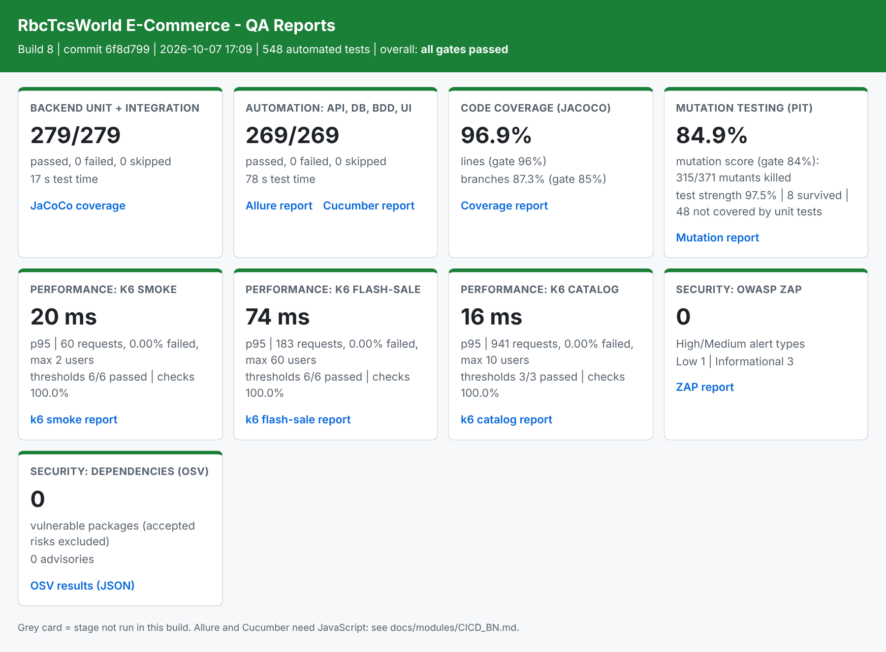
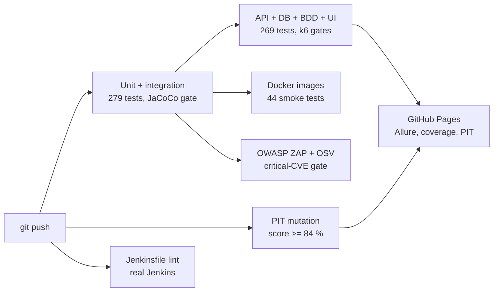

# RbcTcsWorld E-Commerce QA Automation Platform

[](https://github.com/rbchy/RbcTcsWorld_ECommerceSuite/actions/workflows/ci.yml)
   [](https://rbchy.github.io/RbcTcsWorld_ECommerceSuite/coverage/) [](https://rbchy.github.io/RbcTcsWorld_ECommerceSuite/mutation/)
[](https://rbchy.github.io/RbcTcsWorld_ECommerceSuite/)

An Amazon-inspired (not a copy) e-commerce platform built **QA-first** by one engineer: a Spring Boot backend,
a React storefront, and a layered test system that gates every push - in GitHub Actions and in Jenkins.

## At a glance

| Area | What runs on every push | Result |
|---|---|---|
| Unit + integration | 284 JUnit 5 tests (H2 + Flyway, Mockito) | 100 % pass |
| API, DB, BDD, UI | 287 tests: REST Assured, JDBC checks, 43 Cucumber scenarios, 12 Selenium journeys | 100 % pass |
| API contract | 12 strict JSON Schemas (consumer) + OpenAPI breaking-change gate with self-test (provider) | 0 breaking changes |
| Accessibility | axe-core WCAG 2.1 AA checks on all 8 storefront pages | 0 serious/critical (8/8 failed before the fix) |
| Cross-browser | the 20 UI tests also run in Firefox and Edge (CI matrix); Safari selectable in Jenkins | 20/20 in each browser |
| Test quality | JaCoCo coverage gate + PIT mutation testing | 97.5 % lines, 88 % branches, mutation score 84.9 % |
| Performance | k6 smoke, flash sale (60 buyers, 15 units) and catalog with SLO thresholds | 0 % errors, all SLO thresholds met, 0 oversold |
| Security | OWASP ZAP API scan (116 rules pass), OSV dependency scan with a critical-CVE gate | 0 Medium/High, 0 open critical CVEs |
| Delivery | Whole app in Docker (one command), 44 smoke tests against the images | healthy, non-root containers |
| Traceability | 63 requirements mapped to tests, checked in CI | 100 % covered |


*One page per Jenkins build with every quality gate (generated by `ci/qa_dashboard.py`).*

**Live reports:** [Allure](https://rbchy.github.io/RbcTcsWorld_ECommerceSuite/) ·
[Coverage](https://rbchy.github.io/RbcTcsWorld_ECommerceSuite/coverage/) ·
[Mutation (PIT)](https://rbchy.github.io/RbcTcsWorld_ECommerceSuite/mutation/) ·
[CI runs](https://github.com/rbchy/RbcTcsWorld_ECommerceSuite/actions)

## Pipeline



## Highlights (real findings, documented in [Defect Reports](docs/qa/DEFECT_REPORTS.md))

- **No overselling under a flash sale.** 300 buyers race for 50 units: exactly 50 orders, stock ends at 0.
  An atomic conditional `UPDATE` plus a CHECK constraint, proven by a concurrency test and by k6 in every build.
- **A test that could never fail (DEF-013).** Coverage was 96 %, but mutation testing showed that
  "a paid order cannot be paid again" passed even when the card was charged: `anyLong()` does not match `null`.
  Fixed, plus 30 targeted tests: mutation score 65.5 % -> 84.9 %, branch coverage 78.8 % -> 87 %.
- **Critical CVEs without a fix, then a framework upgrade.** Two CVSS 9.8 advisories in Spring MVC had no 3.5 patch:
  accepted for a few weeks with a reason, an expiry date and a guard test, then removed for good by upgrading to
  Spring Boot 4.1 (Spring 7, Jackson 3, Tomcat 11) on a branch. The gates caught three problems before the merge:
  a new critical Tomcat CVE, a search race in the UI (DEF-016) and a 500 on malformed query strings (DEF-017).
- **Performance defect found by a load report (DEF-007).** The catalog had no pagination; fixed test-first,
  backward compatible: response size -91 %, endpoint p95 22 ms -> 9 ms.
- **Security hardening found by attack tests.** Brute-force lockout (DEF-003), timing-safe login against
  account enumeration (DEF-004), 21 vulnerable libraries reduced to 0 (DEF-005).
- **Accessibility, test-first.** axe-core checks were written before any fix: all 8 storefront pages failed WCAG 2.1 AA
  (contrast 2.9:1, unlabeled inputs, no page language). Fixed and gated in every build (DEF-018).
- **CI on two systems and two CPU architectures.** Linux x86 (GitHub Actions) and macOS ARM (Jenkins)
  exposed environment-only failures (DEF-008, DEF-014, DEF-015), each fixed at the root without weakening a gate.

QA documents: [Test Strategy](docs/qa/TEST_STRATEGY.md) · [Test Plan](docs/qa/TEST_PLAN.md) ·
[Risk Register](docs/qa/RISK_REGISTER.md) · [Traceability Matrix](docs/qa/TRACEABILITY_MATRIX.md) ·
[Defect Reports (19)](docs/qa/DEFECT_REPORTS.md) · [Test Summary Report (GO)](docs/qa/TEST_SUMMARY_REPORT.md)

## Modules

| # | Module | Status | Docs (Bangla) |
|---|---|---|---|
| 0 | Foundation: roles, JSON errors, correct status codes, seed data | Done | [docs/modules/MODULE_00_FOUNDATION_BN.md](docs/modules/MODULE_00_FOUNDATION_BN.md) |
| 1 | Shopping cart | Done | [docs/modules/MODULE_01_CART_BN.md](docs/modules/MODULE_01_CART_BN.md) |
| 2 | Orders + inventory: atomic stock reservation, cancel, audit trail, admin API | Done | [docs/modules/MODULE_02_ORDERS_INVENTORY_BN.md](docs/modules/MODULE_02_ORDERS_INVENTORY_BN.md) |
| 3 | Checkout: price breakdown (discount, shipping, 6% tax), coupons, mock payment gateway, refunds | Done | [docs/modules/MODULE_03_CHECKOUT_PAYMENT_BN.md](docs/modules/MODULE_03_CHECKOUT_PAYMENT_BN.md) |
| 4 | Order state machine, shipping, tracking timeline (incl. public tracking), returns with refund/restock rules | Done | [docs/modules/MODULE_04_FULFILLMENT_RETURNS_BN.md](docs/modules/MODULE_04_FULFILLMENT_RETURNS_BN.md) |
| - | Allure reporting: Epics/Features, HTTP attachments, failure categories, trend history, published on GitHub Pages | Done | [docs/modules/ALLURE_REPORT_BN.md](docs/modules/ALLURE_REPORT_BN.md) |
| - | Storefront pages (login, cart, checkout, orders, pay / cancel / return) + Selenium Page Objects and UI journey tests, run headless in CI | Done | [docs/modules/FRONTEND_UI_TESTS_BN.md](docs/modules/FRONTEND_UI_TESTS_BN.md) |
| 5 | Verified-purchase reviews, ratings (race-safe average), moderation, wishlist with price-drop and move-to-cart; product page + wishlist UI | Done | [docs/modules/MODULE_05_REVIEWS_WISHLIST_BN.md](docs/modules/MODULE_05_REVIEWS_WISHLIST_BN.md) |
| - | k6 performance: smoke, load, stress, spike, soak and a flash-sale concurrency test (no overselling); SLO thresholds, HTML report, smoke + flash sale in every CI build | Done | [docs/modules/PERFORMANCE_K6_BN.md](docs/modules/PERFORMANCE_K6_BN.md) |
| - | Security: brute-force lockout, timing-safe login, JWT hardening, security headers; JWT/access-matrix/injection/exposure tests; OWASP ZAP API scan + OSV dependency scan in CI (21 vulnerable libraries -> 0) | Done | [docs/modules/SECURITY_BN.md](docs/modules/SECURITY_BN.md) |
| - | QA documentation: test strategy, test plan, risk register, traceability matrix (63 requirements, checked in CI), 19 real defect reports, test summary report with go/no-go | Done | [docs/qa/](docs/qa/README.md) · [Bangla guide](docs/modules/QA_DOCUMENTS_BN.md) |
| - | CI/CD: whole app in Docker (one command), JaCoCo coverage gate, full Jenkinsfile validated by a real Jenkins, Docker smoke job, critical-CVE gate with expiring exceptions | Done | [docs/modules/CICD_BN.md](docs/modules/CICD_BN.md) |
| - | Mutation testing (PIT): found a test that could never fail, 30 targeted tests, score 65.5 % -> 84.9 %, gate in CI and Jenkins; one "QA Reports" page per Jenkins build | Done | [docs/modules/MUTATION_BN.md](docs/modules/MUTATION_BN.md) |
| - | Spring Boot 3.5 -> 4.1 upgrade on a branch: both accepted CVEs fixed, 0 vulnerable libraries, 2 regressions found by the gates and fixed (DEF-016, DEF-017) | Done | [docs/modules/SPRING_BOOT_4_BN.md](docs/modules/SPRING_BOOT_4_BN.md) |
| - | API contract tests (12 JSON Schemas incl. privacy rules, OpenAPI breaking-change gate) and WCAG 2.1 AA accessibility tests (axe-core, 8 pages; written first, all failed, storefront fixed) | Done | [docs/modules/API_CONTRACT_A11Y_BN.md](docs/modules/API_CONTRACT_A11Y_BN.md) |

## Ports and accounts (development)

| Thing | Value |
|---|---|
| Backend API | http://localhost:8081 (8080 is left free for Jenkins) |
| Frontend | http://localhost:5173 (proxies `/api` to 8081) |
| PostgreSQL | localhost:5432, db/user/password `ecommerce` |
| Seeded admin | `admin@rbctcsworld.com` / `Admin@12345` (override with `ADMIN_EMAIL`, `ADMIN_PASSWORD`) |
| Seeded coupons | `WELCOME10` (10%, once per customer), `SAVE5` ($5, min $25), `EXPIRED20`, `FUTURE15`, `DISABLED` |
| Test cards | `4242424242424242` approved, `4000000000000002` declined, `4000000000009995` insufficient funds |

## Run locally

**The whole application with one command** (PostgreSQL + backend + storefront in containers):

```bash
docker compose --profile app up -d --build        # storefront http://localhost:5173, API http://localhost:8081
docker compose --profile app down                 # stop (add -v to delete the database)
```

**Development** (backend from Eclipse / Maven, live-reloading UI):

```bash
docker compose up -d                              # PostgreSQL only
cd backend && mvn spring-boot:run                 # API on 8081, Flyway creates tables + demo products
cd frontend && npm install && npm run dev         # UI on 5173
```

## Tests

> The root build (`mvn test` in this folder) runs **backend tests only**. The automation suite needs the
> backend running on 8081 first (and the frontend on 5173 for `ui` tests), so run it explicitly as below,
> or with `mvn test -Pe2e`. Otherwise every API test fails with `Connection refused`.

```bash
mvn -f backend/pom.xml test                       # unit + integration (H2, no Docker needed)
mvn -f automation/pom.xml test -DexcludedGroups=ui   # API + BDD against the running backend
mvn -f automation/pom.xml test -Dgroups=ui -Dheadless=false   # UI (backend + frontend running)
mvn -f automation/pom.xml test -Dgroups=db         # database validation (PostgreSQL running)
mvn -f automation/pom.xml test -Dgroups=concurrency   # flash-sale overselling test
mvn -f automation/pom.xml test -Dgroups=payment     # mock payment gateway
mvn -f automation/pom.xml test -Dgroups=security    # IDOR, RBAC, card-data storage
mvn -f automation/pom.xml test -Dgroups=returns     # return decision table
mvn -f automation/pom.xml test -Dgroups=contract    # API responses against the JSON Schemas
mvn -f automation/pom.xml test -Dgroups=a11y        # WCAG 2.1 AA (backend + frontend running)
mvn -f automation/pom.xml test -Dgroups=ui -Dbrowser=firefox   # chrome (default) | firefox | edge | safari
mvn -f automation/pom.xml test -Dcucumber.filter.tags="@flagship"   # full register-to-refund journey
```

Reports:
- **Allure** (graphs, Epics/Features, every HTTP request/response, Gherkin steps, screenshots on UI failure):
  `mvn -f automation/pom.xml allure:serve` after a test run (use `mvn clean test` so old results do not mix in).
  CI publishes it on every push to `main`: **https://rbchy.github.io/RbcTcsWorld_ECommerceSuite/**
- Cucumber HTML: `automation/target/cucumber-report.html`; raw JUnit XML: `automation/target/surefire-reports`.

## Eclipse

File → Import → Maven → Existing Maven Projects → select this folder → Finish.
After pulling new modules: right-click project → Maven → Update Project (Alt+F5).

## Architecture

- Backend: Spring Boot 4.1 (Spring Framework 7, Jackson 3, Tomcat 11), Java 21, PostgreSQL, Flyway, Spring Security + JWT (roles CUSTOMER / ADMIN).
- Automation: JUnit 5, REST Assured (API clients), JDBC (read-only DB validation), Selenium (Page Objects), Cucumber + PicoContainer.
- Frontend: React + Vite.
- Containers: multi-stage Dockerfiles (backend on JRE 21 as a non-root user, storefront on nginx with the `/api` reverse proxy), compose start order by health checks.
- CI/CD: GitHub Actions and an equivalent Jenkinsfile (validated by a real Jenkins in CI). Gates: tests, JaCoCo coverage (>= 97 % lines, >= 88 % branches), PIT mutation score (>= 84 %), traceability check, Docker smoke, k6 thresholds, OWASP ZAP, OSV-Scanner.
- Coverage report: https://rbchy.github.io/RbcTcsWorld_ECommerceSuite/coverage/ | Mutation report (PIT): https://rbchy.github.io/RbcTcsWorld_ECommerceSuite/mutation/

No automation suite can guarantee finding every defect; the goal is risk-based, layered coverage.
